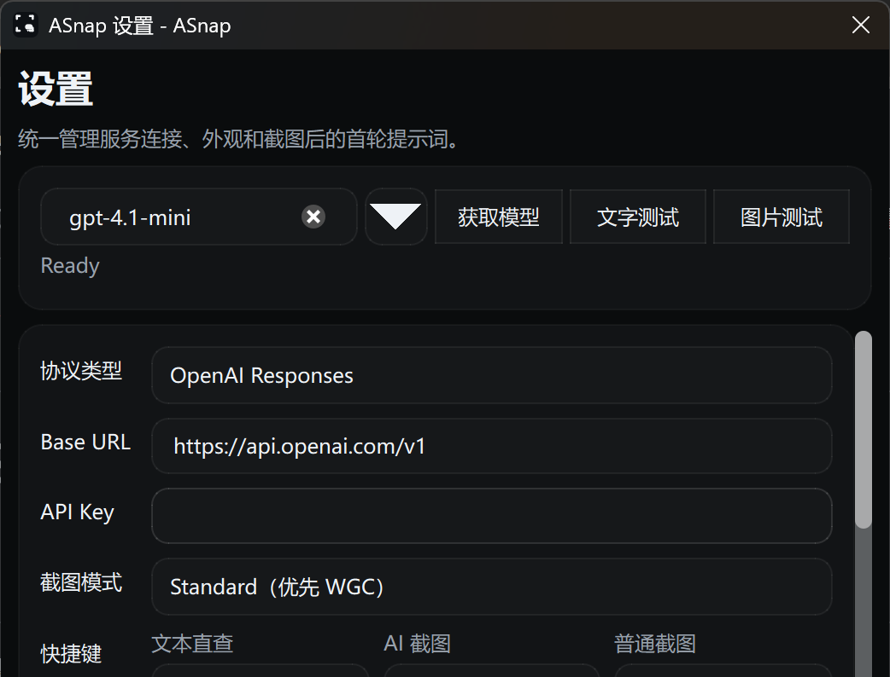

# ASnap

Windows 桌面 AI 截图助手：冻结屏幕、自由框选、立刻提问，并在截图旁继续追问。

<p>
  <a href="https://github.com/Wack520/ASnap/releases">
    
  </a>
  <a href="https://github.com/Wack520/ASnap/releases">
    
  </a>
  <a href="https://github.com/Wack520/ASnap/actions/workflows/windows-ci.yml">
    
  </a>
  <a href="./LICENSE">
    
  </a>
</p>



## 亮点

- 全局快捷键：文本直查 / AI 截图 / 普通截图
- 冻结屏幕后自由框选，截图后贴边打开对话面板
- 选中文字后一键提问，减少截图上传和 token 消耗
- 支持 Markdown、代码块、表格、链接和连续追问
- 支持 OpenAI、OpenAI Responses、OpenAI-compatible、Gemini、Claude
- 可配置截图模式、快捷键、主题、颜色、透明度和首轮提示词

## 下载

从 [Releases](https://github.com/Wack520/ASnap/releases) 下载：

```text
ASnap-Setup-windows-x64-<version>.exe
```

运行安装器即可，无需手动拷贝 Qt 运行库。

## 从源码构建

依赖：

- Windows 10 / 11
- Visual Studio 2022 Build Tools（MSVC）
- CMake 3.28+
- Qt 6.8+

```powershell
$env:CMAKE_PREFIX_PATH='C:\Qt\6.8.3\msvc2022_64'
cmake -S native -B build/native
cmake --build build/native --config Debug --parallel
ctest --test-dir build/native -C Debug --output-on-failure
```

打包安装器：

```powershell
.\scripts\package-windows.ps1 -Configuration Release -RunTests -CreateInstaller -Version local
```

## 隐私说明

你发送给模型服务端的内容可能包括截图、选中文本、输入消息和当前会话上下文。
如果使用第三方 Base URL 或中转服务，请先确认对方的日志、存储和隐私策略。

## License

MIT
